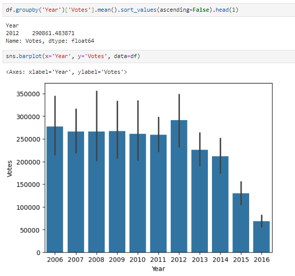

# Exploring IMDB Movies Dataset

## Introduction

The film industry is a significant cultural and economic force, with movies serving as a primary source of entertainment for millions worldwide. Understanding the trends and factors that contribute to the success of a film can provide valuable insights for filmmakers, producers, and audiences alike. This project aims to analyze a dataset of movies from IMDb, one of the most popular and comprehensive online databases for films and television shows.
The primary objective of this project is to explore various aspects of the movies in the dataset, such as runtime, voting trends, revenue, and ratings, to answer key questions about the film industry. By examining data such as movie titles, directors, genres, and release years, we aim to uncover patterns and insights that highlight the factors contributing to a movie's popularity and financial success.
This analysis will also explore how movie ratings impact revenue, identify trends in movie production over time, and classify films based on their ratings. Ultimately, this project seeks to provide a comprehensive overview of the dataset, offering a deeper understanding of the cinematic landscape and the elements that define successful films.
Through data preprocessing and exploratory data analysis, we will address specific questions related to movie length, director performance, genre diversity, and more. The findings from this project could be useful for stakeholders in the film industry to make informed decisions and predict future trends.

## Data Source

- Where is the data coming from? 
The data is sourced from Kaggle (an Excel extract), [see here to find it.](https://www.kaggle.com/datasets/PromptCloudHQ/imdb-data)

## Dataset Overview

The IMDb movies dataset is a comprehensive collection of information about films spanning various genres and release years. This dataset provides valuable insights into the film industry by capturing key attributes related to movies, including their popularity, financial performance, and critical reception. The dataset consists of the following columns:
•	Rank: The ranking of the movie within the dataset, typically based on a combination of factors such as rating and votes.
•	Title: The title of the movie, which serves as its primary identifier.
•	Genre: The genre(s) of the movie, indicating its classification, such as Action, Comedy, Drama, etc.
•	Description: A summary of the movie's plot or storyline.
•	Director: The name of the director(s) responsible for the film's creation.
•	Actors: A list of the main actors starring in the movie.
•	Year: The year in which the movie was released.
•	Runtime (Minutes): The duration of the movie, measured in minutes.
•	Rating: The average user rating of the movie on a scale, typically from 1 to 10.
•	Votes: The total number of user votes submitted for the movie.
•	Revenue (Millions): The total box office revenue generated by the movie, measured in millions of dollars.
•	Metascore: A weighted average of various critics' reviews, providing an aggregate score out of 100.
This dataset offers a rich source of information for analyzing trends in the film industry, such as the relationship between ratings and revenue, the popularity of different genres, and the performance of directors. The data spans multiple decades, allowing for a historical perspective on changes in movie production and reception.
The dataset is structured in a tabular format, with each row representing a unique movie and each column providing specific details about that movie. By leveraging this data, we can perform a variety of analyses to uncover insights into the factors that influence a movie's success and longevity in the entertainment industry.

## Data Preprocessing

Data preprocessing is a crucial step in any data analysis project, ensuring that the dataset is clean, consistent, and ready for analysis. For this project, we focused on handling missing values and checking for duplicates in the IMDb movies dataset.
Handling Missing Values
Missing data can introduce bias and reduce the quality of analysis, so it's important to address these issues early in the process. In this dataset, we identified several columns with missing values, including revenue and metascore.
To handle this, we decided to drop all rows containing missing values. This approach ensures that our analysis is based on complete data entries, avoiding any potential distortions caused by incomplete information. While this may reduce the overall size of the dataset, it maintains the integrity and reliability of the analysis.
Checking for Duplicates
Duplicate entries can skew analysis results by introducing redundancy and biasing statistical measures. Therefore, we checked the dataset for any duplicate rows.
Upon inspection, we found that there were zero duplicates in the dataset. This indicates that each movie entry is unique, and we can proceed with the analysis without concern for data redundancy.
These preprocessing steps have prepared the dataset for the subsequent exploratory data analysis, allowing us to draw meaningful insights from clean and reliable data.

## Exploratory Data Analysis

This section is the core of the document, where we discuss each question, here are our:

1. Display Top 10 Rows of The Dataset

2. Check Last 10 Rows of The Dataset 

3. Find Shape of Our Dataset (Number of Rows and Number of Columns) 

4. Getting Information About Our Dataset Like Total Number Rows, Total Number of Columns, Datatypes of Each Column and Memory Requirement 

5. Check Missing Values in The Dataset 

6. Drop All the Missing Values 

7. Check For Duplicate Data 

8. Get Overall Statistics About the Data Frame 

9. Display Title of The Movie Having Runtime Greater Than or equal to 180 Minutes 

10. In Which Year There Was the Highest Average Voting? 

11. In Which Year There Was the Highest Average Revenue? 

12. Find The Average Rating for Each Director 

13. Display Top 10 Lengthy Movies Title and Runtime 

14. Display Number of Movies Per Year 

15. Find Most Popular Movie Title (Highest Revenue) 

16. Display Top 10 Highest Rated Movie Titles And its Directors.

17. Display Top 10 Highest Revenue Movie Titles.

18. Find Average Rating of Movies Year Wise 

19. Does Rating Affect Revenue? 

20. Classify Movies Based on Ratings [Excellent, Good, and Average] 

![Classification Of Movies Based on Ratings [Excellent, Good, and Average]](assets/images/20.png)

21. Count Number of Action Movies 

22. Find Unique Values from Genre 

23. How Many Films of Each Genre Were Made?

